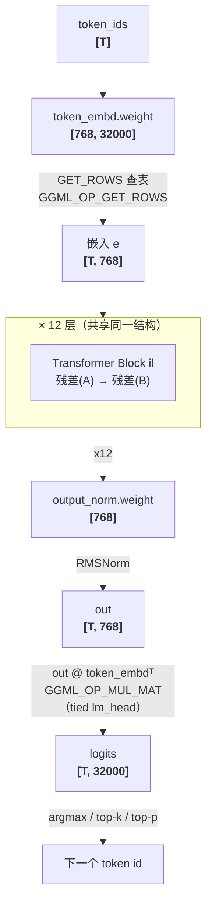
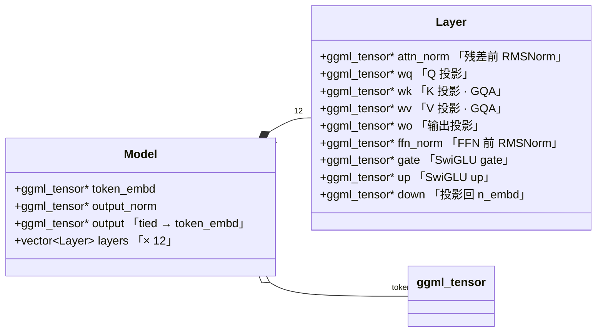
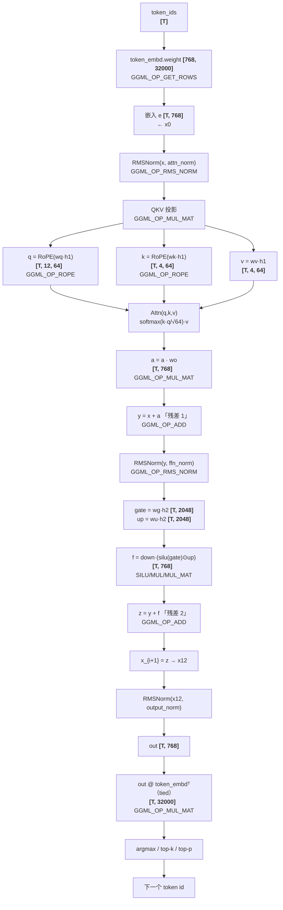
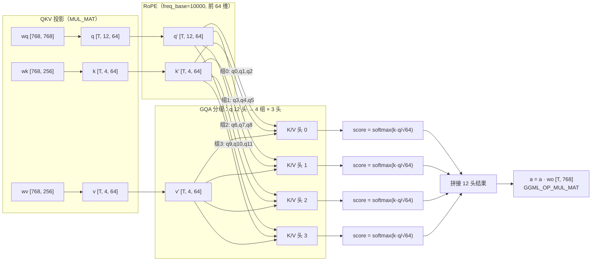
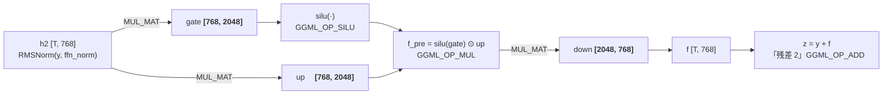
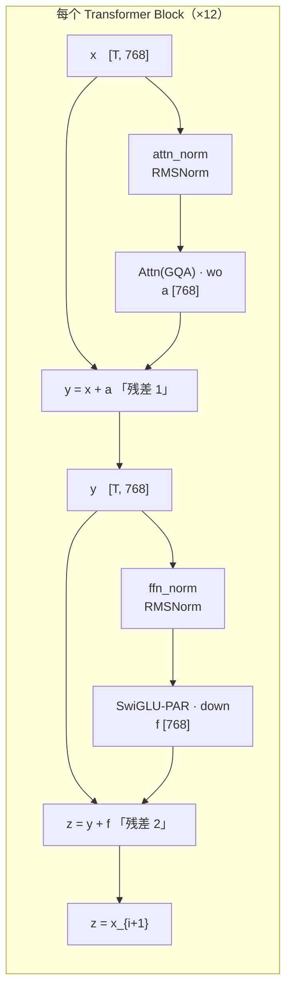

# tinybrainbot 模型计算图

> 本章（06，llama-model-layer）记录的 tinybrainbot 计算图。
> 依据：上游 `llama.cpp/src/models/llama.cpp` 的 `graph<false>` 前向（126–247 行）
> + 06 章实测的 tensor 形状。这是「有语义的模型」要跑的前向蓝图；
> 对应算子实现在后续（前向）章节，这里只记录结构。
>
> 图中 `[行, 列]` = ggml 的 `ne[]`（行主序，`ne[0]` 是列 / 最内维）。

---

## 1. 模型总览

- **架构**：plain Llama（decoder-only transformer），14 个模块 = 嵌入 + 12 层 + 输出
- **参数**（实测，见 `llm.hparams`）：

| 维度 | 值 | 含义 |
|------|----|------|
| `n_layer` | 12 | transformer 层数 |
| `n_embd` | 768 | 隐藏维度 |
| `n_head` | 12 | 注意力 Q 头数 |
| `n_head_kv` | 4 | 注意力 KV 头数（GQA） |
| `n_gqa()` | 3 | `12/4`，每个 KV 头服务 3 个 Q 头 |
| `n_embd_head_k/v` | 64 | 每头 K/V 维度 |
| `n_embd_k_gqa()` | 256 | `64×4`，所有 KV 头拼起的 K/V 维度 |
| `n_ff` | 2048 | 前馈中间维度 |
| `n_vocab` | 32000 | 词表大小 |
| `n_rot` | 64 | RoPE 旋转维度 |
| `freq_base` | 10000 | RoPE 频率基 |
| `norm_eps` | 1e-5 | RMSNorm epsilon |

- **张量身份**：`token_embd [768, 32000]` + 每层 9 个权重 + `output_norm [768]`，共 110 个
- **无独立 lm_head**：`output` 权重绑定复用 `token_embd`（`Model::output == token_embd`）

### 高层架构（Mermaid）



---

## 2. 每层的权重 bag（`Layer`，9 个）

> `Layer` 是一个持有 9 个 `ggml_tensor*` 指针的 bag（见 `include/llama-model.h`），
> 全部指向 `llm.tensors` 里对应的平铺张量——**不复制数据**，纯语义组装。



| 字段 | tensor 名 | 形状 | 语义 |
|------|-----------|------|------|
| `attn_norm` | `blk.{i}.attn_norm.weight` | `[768]` | 注意力前 RMSNorm |
| `wq` | `blk.{i}.attn_q.weight` | `[768, 768]` | Q 投影（12 头） |
| `wk` | `blk.{i}.attn_k.weight` | `[768, 256]` | K 投影（4 头，GQA） |
| `wv` | `blk.{i}.attn_v.weight` | `[768, 256]` | V 投影（4 头，GQA） |
| `wo` | `blk.{i}.attn_output.weight` | `[768, 768]` | 注意力输出投影 |
| `ffn_norm` | `blk.{i}.ffn_norm.weight` | `[768]` | 前馈前 RMSNorm |
| `gate` | `blk.{i}.ffn_gate.weight` | `[768, 2048]` | SwiGLU gate（w1） |
| `up` | `blk.{i}.ffn_up.weight` | `[768, 2048]` | SwiGLU up（w3） |
| `down` | `blk.{i}.ffn_down.weight` | `[2048, 768]` | 投影回 n_embd（w2） |

> **形状怎么读**：ggml 里 `ne=[cols, rows]`。如 `wq [768,768]` 表示 `ne[0]=768` 列、`ne[1]=768` 行。
> 矩阵乘 `MUL_MAT(wq, h1)` 的效果是 `wq · h1 ≈ [n_embd_head×n_head, n_embd] · [n_embd, T]`。

---

## 3. 端到端数据流（带形状）



### 纯 ASCII 版（标注每个算子的上游位置）

```
token_ids [T]                   输入一个 batch（T 个 token）
   │
   ▼
token_embd.weight [768,32000]   GGML_OP_GET_ROWS 查表（build_inp_embd）
e [T, 768]
   │
   ▼   x0 = e
for il in 0..11:
   │
   ├─ ① 注意力子层（残差 1）
   │  x [T, 768]
   │  │  RMSNorm(x, attn_norm)          GGML_OP_RMS_NORM（build_norm, LLM_NORM_RMS）
   │  ▼  h1 [T, 768]
   │  q = RoPE(wq · h1)  [T, 12, 64]    GGML_OP_MUL_MAT + ROPE（build_qkv / ggml_rope_ext）
   │  k = RoPE(wk · h1)  [T, 4,  64]    （GQA：4 个 kv 头，见 §4 头部特写）
   │  v = wv · h1        [T, 4,  64]
   │  a = Attn(q,k,v)              softmax(k·q/√64)·v   （build_attn，见前向章）
   │  a = a · wo          [T, 768]       GGML_OP_MUL_MAT
   │  y = x + a                       ← 残差 1（GGML_OP_ADD，models/llama.cpp 178 行）
   │
   ├─ ② 前馈子层（残差 2）
   │  y [T, 768]
   │  │  RMSNorm(y, ffn_norm)          GGML_OP_RMS_NORM
   │  ▼  h2 [T, 768]
   │  gate = wg · h2   [T, 2048]
   │  up   = wu · h2   [T, 2048]
   │  f    = down · ( silu(gate) ⊙ up )  [T, 768]   GGML_OP_SILU/MUL/MUL_MAT（build_ffn）
   │                                      （LLM_FFN_SILU, LLM_FFN_PAR）
   │  z = y + f                        ← 残差 2（GGML_OP_ADD，models/llama.cpp 220 行）
   │
   ▼  x_{i+1} = z
x12 [T, 768]
   │
   ▼  RMSNorm(x12, output_norm)
out [T, 768]
   │
   ▼  out @ token_embd^T（权重绑定 lm_head）  GGML_OP_MUL_MAT
logits [T, 32000]
   │
   ▼  argmax / top-k / top-p
 下一个 token id
```

---

## 4. 注意力子层特写（GQA 头如何分组）

tinybrainbot 用 **GQA**：`n_head=12` 个 Q 头，但只有 `n_head_kv=4` 个 KV 头，
每组 `n_gqa=3` 个 Q 头**共享同一个 K/V 头**，省 KV-cache 显存。



**维度对账**（验证 GQA）：

| 量 | 计算 | 值 |
|----|------|-----|
| Q 总维度 | `n_head × n_embd_head_k` | `12 × 64 = 768` = `n_embd` ✓ |
| K/V 总维度 | `n_head_kv × n_embd_head_k` | `4 × 64 = 256` = `n_embd_k_gqa()` ✓ |
| 组大小 | `n_gqa()` | `12 / 4 = 3` ✓ |
| 每层 kv-cache 大小（单 token，单头） | `64 × 4` | 256 元素 |

---

## 5. 前馈子层特写（SwiGLU + Parallel）



```
h2 ──── MUL_MAT ──▶ gate [2048] ──▶ silu ─┐
   │                                       ├─⊙ ──▶ MUL_MAT(down) ──▶ f [768] ──(y+)──▶ z [768]
   └─── MUL_MAT ──▶ up   [2048] ──────────┘
```

> `LLM_FFN_PAR`（parallel）：gate 和 up **各自看原始输入**再相乘（`silu(W_gate·x) ⊙ (W_up·x)`），
> 而不是串行的 `W₂·silu(W₁·x)`。这是 FFN **内部接法**，与层间残差的串/并无关。

---

## 6. 残差架构（重点）

每个 transformer 层是**两个串行残差子层**，每个子层都是「先 RMSNorm → 算子 → 残差加法」（**post-residual**）：



```
        x ───────────────────────────────┐
        │    ┌─────────┐                  │
        └───▶│attn_norm│──▶ Attn(GQA) ──▶ y = x + a
             └─────────┘                  │
        y ────────────────────────────────┤
        │    ┌─────────┐                  │
        └───▶│ffn_norm │──▶ SwiGLU-PAR ──▶ z = y + f
             └─────────┘
```

- `a = Attn(...) · wo`，`f = down · silu(gate)⊙up`
- 残差是**后置**的（post-residual）：`out = norm(x)` 之后做算子，最后 `x + 算子结果`
- 12 层堆叠后，最终 `RMSNorm` + tied lm_head 出 logits

---

## 7. 术语澄清：两种「PAR」

- `LLM_FFN_PAR`（parallel FFN）：指 **FFN 内部 SwiGLU 的接法**——gate 和 up 各自看原始输入再相乘
  （`silu(W_gate·x) ⊙ (W_up·x)`），不是残差类型。
- 层间残差是**串行**（attn 残差 → ffn 残差），不是 parallel-residual 块。

---

## 8. 图算子对照（上游）

| 步骤 | 算子 | 上游位置 |
|------|------|----------|
| 查表 | GET_ROWS | `build_inp_embd` |
| 归一 | RMS_NORM | `build_norm`（LLM_NORM_RMS） |
| QKV | MUL_MAT | `build_qkv` |
| 位置 | ROPE | `ggml_rope_ext` |
| 注意力 | 见前向章 | `build_attn` |
| 残差 | ADD | `models/llama.cpp` 178/220 行 |
| FFN | SILU/MUL/MUL_MAT | `build_ffn`（LLM_FFN_SILU, LLM_FFN_PAR） |

---

后续（前向章节）将按这份图，把每个算子真正实现并把结果接起来，跑出 logits。
